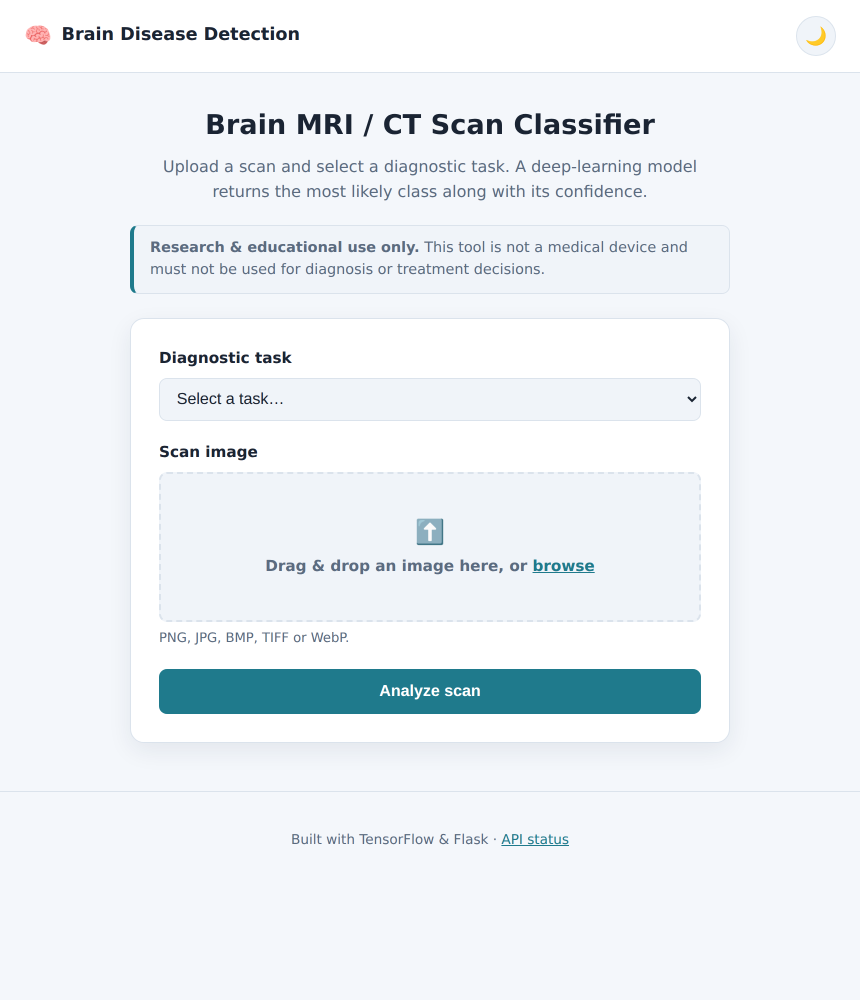
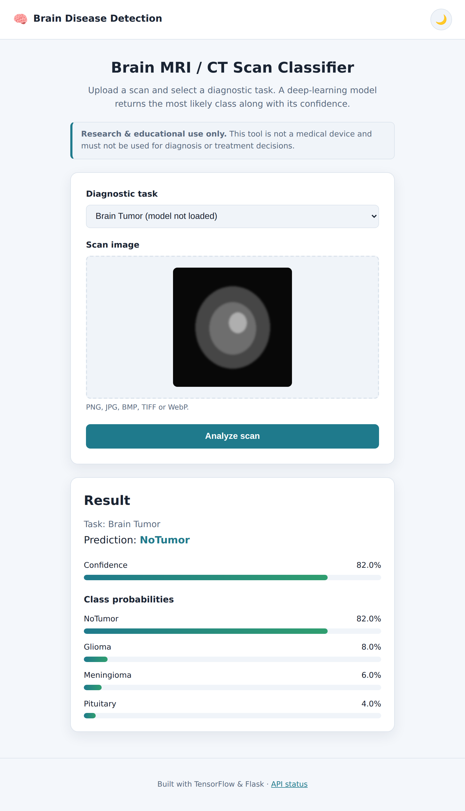
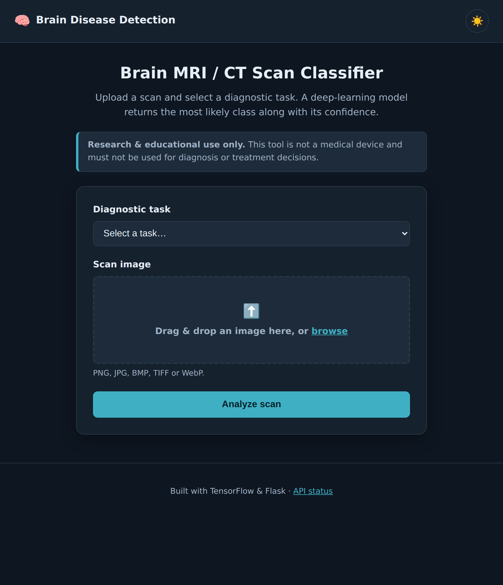
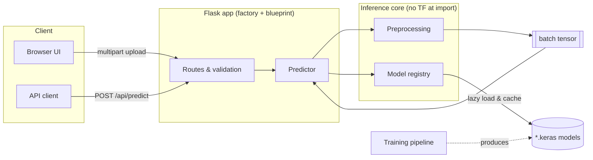

# 🧠 Brain Disease Detection

Deep-learning classification of brain **MRI / CT** scans across three diagnostic
tasks — **Alzheimer's disease**, **brain stroke**, and **brain tumor** — served
through a Flask web application and a JSON REST API.

[](https://github.com/ChetanKumor/Brain-Disease-Detection/actions/workflows/ci.yml)


[](https://github.com/astral-sh/ruff)
[](LICENSE)

> ⚠️ **Research & educational use only.** This project is **not** a medical
> device and must not be used for clinical diagnosis or treatment decisions.

---

## 📸 Preview

| Home (light) | Prediction result |
| :---: | :---: |
|  |  |

<details>
<summary>Dark theme</summary>



</details>

_The result view shows the predicted class, a confidence score, and the full
per-class probability breakdown. (Screenshots use a placeholder model; train a
model as described below to get real predictions.)_

---

## Overview

Manual review of brain scans is time-consuming and requires specialist
expertise. This project explores how a convolutional neural network can provide
a fast, automated **second-opinion** signal by classifying a scan into a set of
diagnostic categories, and wraps that model in a clean, production-shaped web
service.

The repository is intentionally structured like a real product rather than a
notebook: configuration, training, inference, and the web layer are separate,
tested, and independently reusable modules.

## Features

- 🩺 **Three diagnostic tasks** — Alzheimer's (4 stages), brain stroke (3 classes), brain tumor (4 classes).
- 🔬 **Transfer learning** — fine-tunes an ImageNet backbone (MobileNetV2 by default) with a two-phase schedule.
- 🌐 **Web UI + REST API** — server-rendered form (works without JavaScript) and a JSON `/api/predict` endpoint.
- 📊 **Explainable output** — every prediction returns a confidence score and the full per-class probability distribution.
- ⚙️ **Config-driven** — image geometry, class labels, hyper-parameters, and paths live in one YAML file.
- 🧱 **Decoupled & testable** — the inference/web layers depend on an abstract model provider, so the full test suite runs without TensorFlow.
- 🛡️ **Robust** — input validation, typed configuration, a custom exception hierarchy, and structured logging.
- 🐳 **Deployable** — production Dockerfile (non-root, health-checked, gunicorn) and CI on Python 3.10–3.12.

## Architecture



**Separation of concerns**

| Layer | Package | Responsibility |
| ----- | ------- | -------------- |
| Configuration | `config`, `constants` | Typed, validated, YAML + env configuration |
| Data | `data.preprocessing` | Decode / resize / normalise images (Pillow + NumPy) |
| Models | `models.architecture`, `models.registry` | Build the network; lazily load & cache trained weights |
| Training | `training.*` | Reproducible splits, two-phase transfer learning, evaluation |
| Inference | `inference.predictor` | Orchestrate preprocessing → model → post-processing |
| Web | `web.*` | Flask factory, routes, REST API, templates, static assets |

## Project structure

```
Brain-Disease-Detection/
├── configs/
│   └── config.yaml               # single source of truth for settings
├── data/                         # datasets (git-ignored; see data/README.md)
├── docs/
│   └── screenshots/
├── models/                       # trained *.keras weights (git-ignored)
├── scripts/
│   └── train.py                  # thin CLI wrapper around the trainer
├── src/brain_disease_detection/
│   ├── config.py  constants.py  exceptions.py  logger.py
│   ├── data/                     # preprocessing
│   ├── models/                   # architecture + registry
│   ├── training/                 # data loader, trainer, CLI
│   ├── inference/                # predictor
│   └── web/                      # app factory, routes, templates, static
├── tests/                        # pytest suite (unit + integration)
├── Dockerfile  docker-compose.yml  Makefile
├── pyproject.toml  requirements.txt  requirements-dev.txt
└── wsgi.py                        # gunicorn / local entry point
```

## Tech stack

**ML:** TensorFlow / Keras, NumPy, Pillow · **Web:** Flask, Gunicorn ·
**Tooling:** pytest, Ruff, mypy, Docker, GitHub Actions.

## Getting started

### Prerequisites

- Python 3.10+
- (Optional) Docker, for containerised runs

### Installation

```bash
git clone https://github.com/ChetanKumor/Brain-Disease-Detection.git
cd Brain-Disease-Detection

python -m venv .venv && source .venv/bin/activate
pip install -r requirements.txt          # runtime (includes TensorFlow)
# or, for development/testing without TensorFlow:
pip install -r requirements-dev.txt
```

### Configure

```bash
cp .env.example .env       # then edit values (SECRET_KEY, PORT, ...)
```

| Variable | Default | Description |
| -------- | ------- | ----------- |
| `APP_ENV` | `development` | `production` disables debug mode |
| `HOST` / `PORT` | `0.0.0.0` / `8000` | Bind address |
| `SECRET_KEY` | `change-me` | Flask session secret |
| `MAX_UPLOAD_MB` | `10` | Reject uploads larger than this |
| `MODELS_DIR` | `models` | Where trained `*.keras` files live |
| `LOG_LEVEL` | `INFO` | Logging verbosity |

### Run the web app

```bash
python wsgi.py                                   # development
gunicorn "wsgi:app" --bind 0.0.0.0:8000 --workers 2   # production
```

Then open <http://localhost:8000>. The app runs even **without** trained
models — the UI marks unavailable tasks, and `/api/health` reports which models
are loaded — so you can explore the interface before training anything.

## Training your own models

The models themselves are **not** committed (they are large binaries). Arrange a
dataset as one folder per class (see [`data/README.md`](data/README.md)):

```
data/brain_tumor/{Glioma,Meningioma,NoTumor,Pituitary}/*.jpg
```

Then train:

```bash
python scripts/train.py --disease brain_tumor --data-dir data/brain_tumor
python scripts/train.py --disease all --epochs 40      # every configured task
```

Each run writes `<disease>_model.keras` and a `<disease>_metrics.json`
(test-set accuracy/loss + training history) into `models/`.

> **Class-label ordering matters.** Labels in `configs/config.yaml` are listed
> alphabetically to match Keras' `image_dataset_from_directory`, and the trainer
> fails loudly if the on-disk class order disagrees — preventing silent
> label-mapping bugs.

## REST API

| Method | Endpoint | Description |
| ------ | -------- | ----------- |
| `GET`  | `/` | Web UI |
| `POST` | `/` | Form upload → HTML result |
| `POST` | `/api/predict` | `multipart/form-data` (`disease`, `image`) → JSON prediction |
| `GET`  | `/api/diseases` | List configured tasks and model availability |
| `GET`  | `/api/health` | Health check + per-model availability |

```bash
curl -F "disease=brain_tumor" -F "image=@scan.png" \
     http://localhost:8000/api/predict
```

```json
{
  "disease": "brain_tumor",
  "display_name": "Brain Tumor",
  "predicted_label": "NoTumor",
  "confidence": 0.82,
  "probabilities": [
    {"label": "Glioma", "probability": 0.08},
    {"label": "Meningioma", "probability": 0.06},
    {"label": "NoTumor", "probability": 0.82},
    {"label": "Pituitary", "probability": 0.04}
  ]
}
```

## Testing & quality

```bash
make check        # ruff + mypy + pytest
make test         # pytest only
make cov          # pytest with coverage
```

The suite (40+ tests) covers configuration, preprocessing, prediction
post-processing, the model registry, and every HTTP route including error paths.
Stub models are injected via fixtures, so tests run **without** TensorFlow or
trained weights.

## Docker

```bash
docker compose up --build         # serves on :8000, mounts ./models read-only
# or
make docker-build && make docker-run
```

## Model / ML approach

- **Transfer learning** is used because medical-imaging datasets are usually too
  small to train a competitive CNN from scratch. An ImageNet-pretrained backbone
  (MobileNetV2 by default; EfficientNetB0 / ResNet50 selectable) supplies general
  visual features; a lightweight head is trained on top.
- **Two-phase schedule:** (1) train the head with the backbone frozen, then
  (2) unfreeze the top backbone layers and fine-tune at a lower learning rate.
- **Overfitting protection:** on-graph data augmentation, dropout, early
  stopping, and reduce-LR-on-plateau, with best-weights checkpointing.
- **Honest evaluation:** metrics are computed on a held-out **test** split
  (separate from validation) and written to `models/<disease>_metrics.json`.
  No performance numbers are asserted in this README because they depend on the
  dataset you train with.

## Roadmap

- [ ] Grad-CAM saliency overlays to visualise what the model attends to
- [ ] Publish trained weights via GitHub Releases and auto-download on first run
- [ ] Confusion matrices and per-class precision/recall in the metrics report
- [ ] Model-versioning / registry integration (e.g. MLflow)
- [ ] Batch prediction endpoint and simple rate limiting

## Contributing

Contributions are welcome — see [CONTRIBUTING.md](CONTRIBUTING.md). In short:
create a virtualenv, `pip install -r requirements-dev.txt`, and make sure
`make check` passes before opening a PR.

## License

Released under the [MIT License](LICENSE).

## Author

**Chetan Kumor** — [GitHub](https://github.com/ChetanKumor)

_Backbone weights © their respective authors, provided via `tf.keras.applications`._
